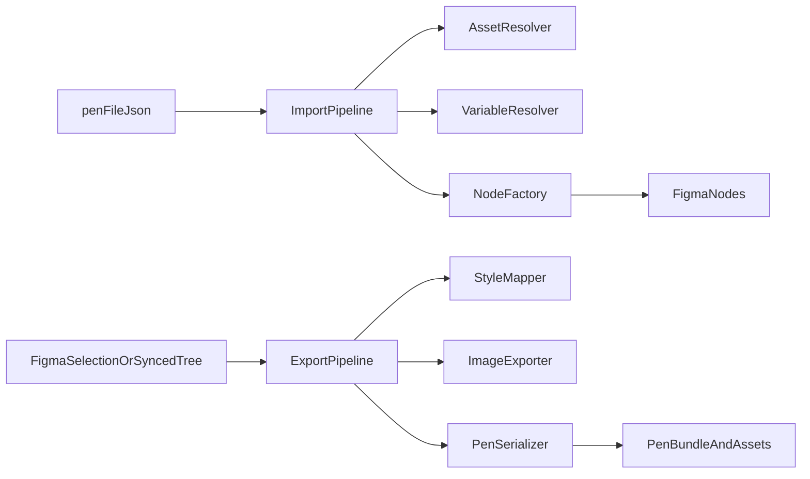

# Figma 与 Pencil 互转功能设计

## 目标
为当前 `pencil-to-figma` 插件定义一份可执行的双向转换规格，作为后续 TypeScript 重构、模块拆分、测试补齐和回归验收的共同依据。

本文重点覆盖：
- Figma Plugin 与 Pencil `.pen` 相关文档入口
- `.pen -> Figma` / `Figma -> .pen` 的总体架构
- 节点级转换设计，尤其是文本、图片、布局、组件实例和矢量
- 已知边界、降级策略与后续增强建议

## 参考文档

### Figma Plugin
- [Figma Plugin Developer Docs](https://developers.figma.com/docs/plugins/)
- [Plugin Manifest](https://developers.figma.com/docs/plugins/manifest/)
- [Creating a User Interface](https://developers.figma.com/docs/plugins/creating-ui/)
- [postMessage](https://developers.figma.com/docs/plugins/api/properties/figma-ui-postmessage/)
- [TypeScript](https://developers.figma.com/docs/plugins/typescript/)
- [TextNode](https://developers.figma.com/docs/plugins/api/TextNode/)
- [loadFontAsync](https://developers.figma.com/docs/plugins/api/properties/figma-loadfontasync/)
- [Working with Images](https://developers.figma.com/docs/plugins/working-with-images/)
- [createImage](https://developers.figma.com/docs/plugins/api/properties/figma-createimage/)
- [createImageAsync](https://developers.figma.com/docs/plugins/api/properties/figma-createimageasync/)
- [exportAsync](https://developers.figma.com/docs/plugins/api/properties/nodes-exportasync/)
- [Shared Node Properties](https://developers.figma.com/docs/plugins/api/node-properties/)

### Pencil.dev
- [Pencil Documentation](https://docs.pencil.dev/)
- [.pen Files](https://docs.pencil.dev/core-concepts/pen-files)
- [The .pen Format](https://docs.pencil.dev/for-developers/the-pen-format)

## 现有项目事实
- 当前仓库是一个 Figma 插件，`manifest.json` 指向 `code.js` 和 `ui.html`。
- 主线程逻辑集中在 `code.js`，承担命令入口、导入、导出、节点创建、图片、颜色、渐变、SVG 等职责。
- UI 逻辑在 `ui.html` 内联脚本中，通过 `parent.postMessage` 与主线程通信。
- 当前导入导出功能已具备基础能力，但文本富样式、复杂图片场景、多层 fill/effect、复杂节点降级策略仍有完善空间。

## 设计目标
- 保持 `.pen` 与 Figma 的双向转换可回环，尽量避免语义丢失。
- 优先保留结构信息，而不是只保留视觉结果。
- 对无法 1:1 表达的场景定义清晰降级策略。
- 为 TypeScript 重构提供稳定的模块边界和类型边界。

## 总体架构

### 导入链路 `.pen -> Figma`
1. 读取 `.pen` JSON 与图片资源。
2. 校验基础 schema 与变量结构。
3. 预扫描组件定义与引用关系。
4. 解析颜色、渐变、图片、排版、布局。
5. 递归创建 Figma 节点。
6. 设置 `pluginData`，建立 `pencilId` 映射。
7. 将分析结果和放置信息通过 UI 展示。

### 导出链路 `Figma -> .pen`
1. 从当前 selection 读取 Figma 节点。
2. 递归收集节点、布局、图形、文本、组件实例关系。
3. 导出图片资源并写入 bundle。
4. 将 Figma 节点序列化为 `.pen` element。
5. 将 `.pen` JSON 与 `assets` 交给 UI 下载。

## 模块设计建议

### `src/shared`
- `pen-types.ts`: `.pen` 领域模型
- `message-types.ts`: UI 与 plugin 的消息协议
- `guards.ts`: 外部数据运行时守卫
- `mapping-types.ts`: 布局、文本、图片模式等共享枚举

### `src/plugin`
- `index.ts`: 插件入口与命令路由
- `import/import-pen.ts`: 导入流程
- `export/export-pen.ts`: 导出流程
- `nodes/create-*.ts`: 各类节点创建
- `styles/color.ts`: 颜色、渐变、透明度
- `styles/stroke.ts`: 描边映射
- `styles/effect.ts`: 阴影和模糊
- `assets/images.ts`: 图片缓存、导入和导出
- `vector/svg.ts`: SVG path 解析与转换

### `src/ui`
- `main.ts`: UI 启动与消息收发
- `state.ts`: 上传、放置、导出状态
- `files.ts`: 读取 `.pen` 与图片目录
- `download.ts`: 导出下载
- `icon-fetch.ts`: 图标 SVG 获取逻辑

## 领域模型设计

### `.pen` 核心能力
- 对象树
- 相对定位
- layout/flex 风格布局
- fill / stroke / effect
- `reusable` 组件
- `ref` 实例
- `descendants` 覆写
- 图片资源相对路径
- 文本基础样式与富样式

### Figma 对应能力
- SceneNode 树
- Auto Layout
- Paint / Stroke / Effect
- Component / Instance
- TextNode
- VectorNode
- Image paint 与图片资源句柄

## 节点转换设计

### Frame / Rectangle / Ellipse / Line

#### `.pen -> Figma`
- `frame` -> `FrameNode`
- `rectangle` -> `RectangleNode`
- `ellipse` -> `EllipseNode`
- `line` -> `LineNode`
- 设置：
  - `x` / `y`
  - `width` / `height`
  - `fill`
  - `stroke`
  - `effect`
  - `opacity`
  - `cornerRadius`
  - `clip`

#### `Figma -> .pen`
- `FRAME` / `COMPONENT` -> `frame`
- `RECTANGLE` -> `rectangle`
- `ELLIPSE` -> `ellipse`
- `LINE` -> `line`
- 回写位置、尺寸、基础图形样式。

### 布局转换设计

Pencil 的布局语义与 Figma Auto Layout 是高度对应的，应作为核心能力实现。

#### `.pen -> Figma`
- `layout: "none"` -> `layoutMode = "NONE"`
- `layout: "horizontal"` -> `layoutMode = "HORIZONTAL"`
- `layout: "vertical"` -> `layoutMode = "VERTICAL"`
- `justifyContent` -> `primaryAxisAlignItems`
- `alignItems` -> `counterAxisAlignItems`
- `gap` -> `itemSpacing`
- `padding` -> `paddingTop/Right/Bottom/Left`
- 当父节点启用布局时，子节点 `x/y` 默认忽略
- `width/height`
  - 数值 -> 固定尺寸
  - `fill_container` -> Fill sizing
  - `hug_contents` -> Hug sizing

#### `Figma -> .pen`
- `layoutMode = NONE` -> `layout: "none"`
- `HORIZONTAL` / `VERTICAL` -> 对应 Pencil layout
- `itemSpacing` -> `gap`
- 四向 padding 合并为 Pencil 简写格式
- 轴向对齐映射为 `justifyContent` / `alignItems`

#### 关键约束
- Auto Layout 父节点下的绝对子节点需要单独处理，后续建议支持 `layoutPosition: "absolute"`。
- 组节点与 Frame 节点在 Figma 中的相对坐标语义不完全相同，导出时要注意 group 子节点的相对定位换算。

### 文本节点转换设计

文本是当前互转设计的高优先级核心能力。

#### 支持目标
- 文本内容
- 字体族
- 字号
- 字重
- 字体样式
- 行高
- 水平对齐
- 垂直对齐
- 文本颜色
- 文本框增长模式
- 后续增强：字距、下划线、删除线、超链接、mixed styles

#### `.pen -> Figma`

##### 基础文本
- `type: "text"` -> `TextNode`
- 设置文本前必须先加载字体
- `content` 为字符串时：
  - `loadFontAsync`
  - 设置 `fontName`
  - 设置 `characters`
  - 设置 `fontSize`
  - 设置 `lineHeight`
  - 设置 `textAlignHorizontal`
  - 设置 `textAlignVertical`
  - 设置 `fills`
  - 根据 `textGrowth` 设置自动扩展或固定宽度

##### 富文本
- 当 `content` 为 `TextStyle[]` 时，采用 range-based 写入
- 每个 range 支持：
  - `fontFamily`
  - `fontSize`
  - `fontWeight`
  - `fontStyle`
  - `fill`
  - `letterSpacing`
  - `underline`
  - `strikethrough`
  - `href`
- 字体加载必须按范围涉及到的字体去预加载

##### 字体降级策略
- 若目标字体不可加载，优先回退到同 family 的基础 style
- 仍失败则回退到 `Inter Regular`
- 字体降级必须记录 warning，避免静默损失

##### 文本尺寸策略
- `textGrowth: "auto"` -> 文本框自动增长，不强设宽高
- `textGrowth: "fixed-width"` -> 固定宽度，高度自增
- `textGrowth: "fixed-width-height"` -> 宽高都固定，允许溢出或裁剪

#### `Figma -> .pen`

##### 单样式文本
- `characters` -> `content`
- `fontName.family` -> `fontFamily`
- `fontName.style` -> `fontWeight` / `fontStyle`
- `fontSize` -> `fontSize`
- `lineHeight` -> `lineHeight`
- `textAlignHorizontal` -> `textAlign`
- `textAlignVertical` -> `textAlignVertical`
- `fills[0]` -> `fill`

##### 混合样式文本
- 若检测到 mixed style：
  - 不应强制压平成单一文本样式
  - 应导出为 `TextStyle[]`
- 需要遍历样式区间并提取：
  - 字体
  - 字号
  - 颜色
  - decoration
  - 链接

#### 当前项目现状
- 已支持基础文本导入和基础文本导出
- 已实现字体加载和 fallback
- 尚未完整支持富文本区间导入导出
- 尚未完整支持 `letterSpacing`、`underline`、`strikethrough`、`href`

#### 结论
文本转换应分为“单样式文本稳定支持”和“富文本范围增强支持”两层。第一层是当前重构必须保留的能力，第二层是高优先级增强项。

### 图片节点转换设计

Pencil 的图片语义更接近“图形节点上的 image fill”，而不是独立位图节点，因此转换设计要分离“图片资源层”和“节点语义层”。

#### 支持目标
- 从 `.pen` 的 image fill 导入为 Figma `IMAGE` paint
- 从 Figma image fill 导出为 `.pen` image fill
- 保持相对路径资源语义
- 对复杂节点支持位图降级导出

#### `.pen -> Figma`

##### 图片资源层
- 从 `.pen` bundle 或上传目录中读取图片
- 缓存索引建议支持：
  - 原始路径
  - 规范化路径
  - `./` 前缀变体
  - 文件名兜底

##### 节点语义层
- 对于 `fill` 中的 image：
  - 读取 `url`
  - 解析 base64 bytes
  - `figma.createImage(bytes)`
  - 写入 `IMAGE` fill
- `mode`
  - `fill` -> `FILL`
  - `fit` -> `FIT`
  - `stretch` -> `STRETCH`

##### 图片节点建模建议
- 纯图片容器可保留为 `frame` 或 `rectangle` + image fill
- 不建议过早把所有图片都建模成单独 `image` 节点
- 若图片元素还叠加描边、圆角、阴影，优先使用容器节点承载图片 fill

#### `Figma -> .pen`

##### 标准 image fill 导出
- 若 `fills[0].type === "IMAGE"`：
  - 优先通过 `figma.getImageByHash(...).getBytesAsync()` 读取原图 bytes
  - 导出为 bundle asset
  - 写入 `.pen`
    - `type: "image"` 仅在确认为纯图片语义时使用
    - 更稳妥的默认方式是 `frame/rectangle + fill: { type: "image" }`

##### 降级导出
- 对于复杂节点、锁定 group、无法拆解的视觉结果：
  - 直接 `exportAsync({ format: "PNG" })`
  - 生成一张位图资源
  - 导出为 `frame + image fill`

#### 当前项目现状
- 已支持从缓存中读取图片，创建 Figma image fill
- 已支持导出 image fill 对应的 asset
- 已支持无法直接取图时 fallback 到 `exportAsync(PNG)`
- 已对 locked group 做 rasterize 降级

#### 关键风险
- Figma 图片资源有尺寸与格式约束
- 多重 fills 下 image 不是唯一主 fill 时，导出语义可能不稳定
- 复杂裁剪、mask、变换未必能完全映射为 `.pen` 的 image fill
- 资源缺失时应 warning，不应导致整次导入中断

### 矢量与 SVG 转换设计

#### `.pen -> Figma`
- `path` / `geometry` -> `VectorNode`
- 使用 SVG path 解析与规范化逻辑
- `fillRule` -> `windingRule`
- 同时支持 fill / stroke / image fill

#### `Figma -> .pen`
- `VECTOR` -> `path`
- 优先导出 `vectorPaths[0].data` 到 `geometry`
- 保留 fillRule、fill、stroke

#### 图标节点
- `icon_font` 可视为特殊矢量来源
- 当前项目通过 UI 拉取 SVG，再回传 plugin 写入 `vectorPaths`
- 建议保留这一机制，但从“业务逻辑”中解耦为独立 `icon-fetch` 子模块

### 颜色、渐变、描边、效果

#### 颜色
- 支持纯色、变量引用、透明色
- 所有颜色在共享模块中统一解析，避免散落在节点工厂中

#### 渐变
- Pencil 支持 `linear` / `radial` / `angular`
- Figma 对应 `GRADIENT_LINEAR` / `GRADIENT_RADIAL` / `GRADIENT_ANGULAR`
- 需要统一处理：
  - color stops
  - opacity
  - rotation
  - transform

#### 图片 fill
- 视为 fill 类型的一种，不在 color parser 中直接当作颜色返回
- 应由图片子系统单独接管

#### 描边
- 支持：
  - thickness
  - align
  - cap
  - join
  - solid / gradient fill

#### 效果
- 首轮重点支持阴影与 blur
- `background_blur` 等高级效果若能力不对等，可先降级或标记不支持

## 组件与实例设计

### `.pen -> Figma`
- `reusable: true` -> 创建 Component
- `type: "ref"` -> 创建 Instance
- `ref` -> 绑定主组件
- `descendants` -> 写入实例覆写

### `Figma -> .pen`
- `COMPONENT` -> `reusable: true`
- `INSTANCE` -> `type: "ref"`
- `mainComponent` -> `ref`
- 子节点覆写尽可能导出到 `descendants`

### 设计原则
- round-trip 要尽量保留“实例语义”，而不是把实例扁平化成普通节点树
- 如果某些覆写在 Pencil 无法表达，需要记录差异并定义回退方案

## 元数据与同步设计

建议每个导入节点都写入：
- `pencilId`
- 必要时记录来源类型、导入版本、资源映射信息

用途：
- selection export
- 后续增量更新
- 组件与实例追踪
- 调试与问题定位

## 消息协议设计

建议统一定义判别联合类型，覆盖当前消息：
- `import-pen`
- `place-import`
- `ready-to-place`
- `import-success`
- `import-error`
- `export-pen`
- `export-data`
- `export-error`
- `download-pen`
- `close-after-download`
- `fetch-icon`
- `icon-svg-fetched`

要求：
- plugin 与 UI 共用同一份消息类型定义
- 所有跨 iframe 的对象必须是 structured-clone-safe
- 错误消息结构标准化，避免一端 `error` 是 string，另一端是 object

## 降级策略

### 必须定义降级的场景
- 锁定 group
- 无法还原的复杂图像结构
- 无法加载的字体
- 无法读取的图片资源
- Pencil 支持但 Figma 不支持的图形能力
- Figma 支持但 Pencil 当前 schema/实现未覆盖的能力

### 推荐降级方式
- 结构保留优先
- 结构无法保留时保留视觉结果
- 视觉也无法保留时至少保留 warning 和最小可编辑节点

## 验收标准

### 基础回环能力
- `frame` / `rectangle` / `ellipse` / `line` / `path`
- 文本基础样式
- image fill
- 基础渐变
- 基础描边
- 基础阴影
- 组件与实例
- Auto Layout 基础映射

### 高优先级增强
- 富文本区间
- 文本 decoration 与链接
- 更完整的图片模式与导出策略
- 更精确的实例 descendants 覆写

### 允许降级
- mesh gradient
- 复杂 blend mode
- 特殊布尔运算或极复杂 mask 结构
- 无法安全回写的复杂 group

## 测试建议
- 文本：
  - 单样式导入导出
  - 字体 fallback
  - fixed-width 文本换行
  - 富文本 range 导入导出
- 图片：
  - image fill 导入
  - asset 导出
  - 缓存命中与路径规范化
  - PNG fallback
- 布局：
  - horizontal / vertical / none
  - padding 简写还原
  - fill_container / hug_contents
- 矢量：
  - SVG path tokenizer
  - fillRule
  - 图标抓取回写
- 组件：
  - reusable / ref
  - descendants 覆写

## 实施优先级

### P0
- 保持当前基础导入导出能力
- 提炼共享类型
- 提炼文本基础映射
- 提炼图片资源与导出逻辑
- 提炼布局与颜色映射

### P1
- 富文本 ranges
- 更稳定的 instance 覆写导出
- 更完整的图片语义建模

### P2
- mesh gradient
- 更复杂的视觉特性保真
- 更细的变量、主题和富文本能力

## 与 TS 重构的关系
这份文档不是产品说明，而是后续 TypeScript 重构的行为规格。后续执行时应以本文为准：
- 拆模块时保持本文定义的边界
- 定义 shared types 时以本文字段语义为准
- 编写测试时以本文验收点为准
- 发现当前实现与本文不一致时，要么修正文档，要么显式记录实现偏差
